# markdown-preview.vim


## todo

- [x] markdown render: markdown-it
- [x] markdown highlight
- [x] markdown css
- [x] math katex
- [x] plantuml
- [x] markdown-it option
- [x] katex option
- [x] plantuml option
- [x] markdown style option
- [x] highlight style option
- [x] sync scroll
- preview page title use the document's name
- favicon.ico
- vim support
- binary support
- task list
- meoji
- cross platform test (mac/linux/windows)
- ...

# UML example:

@startuml
Bob -> Alice : hello
@enduml


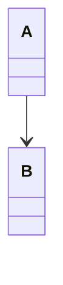


### flowchart

``` flowchart
st=>start: Start|past:>http://www.google.com[blank]
e=>end: End|future:>http://www.google.com
op1=>operation: My Operation|past
op2=>operation: Stuff|current
sub1=>subroutine: My Subroutine|invalid
cond=>condition: Yes
or No?|approved:>http://www.google.com
c2=>condition: Good idea|rejected
io=>inputoutput: catch something...|future

st->op1(right)->cond
cond(yes, right)->c2
cond(no)->sub1(left)->op1
c2(yes)->io->e
c2(no)->op2->e
```

javascript
```javascript
function test() {
    return 0
}

console.log('hello world')

test()
```

bash
```bash
# comment

export path=$PATH;/bin
```

# Maxwell's Equations


equation | description
----------|------------
$\nabla \cdot \vec{\mathbf{B}}  = 0$ | divergence of $\vec{\mathbf{B}}$ is zero
$\nabla \times \vec{\mathbf{E}}\, +\, \frac1c\, \frac{\partial\vec{\mathbf{B}}}{\partial t}  = \vec{\mathbf{0}}$ |  curl of $\vec{\mathbf{E}}$ is proportional to the rate of change of $\vec{\mathbf{B}}$
$\nabla \times \vec{\mathbf{B}} -\, \frac1c\, \frac{\partial\vec{\mathbf{E}}}{\partial t} = \frac{4\pi}{c}\vec{\mathbf{j}}    \nabla \cdot \vec{\mathbf{E}} = 4 \pi \rho$ | _wha?_

$\sqrt{3x-1}+(1+x)^2$

$$\begin{array}{c}

\nabla \times \vec{\mathbf{B}} -\, \frac1c\, \frac{\partial\vec{\mathbf{E}}}{\partial t} &
= \frac{4\pi}{c}\vec{\mathbf{j}}    \nabla \cdot \vec{\mathbf{E}} & = 4 \pi \rho \\

\nabla \times \vec{\mathbf{E}}\, +\, \frac1c\, \frac{\partial\vec{\mathbf{B}}}{\partial t} & = \vec{\mathbf{0}} \\

\nabla \cdot \vec{\mathbf{B}} & = 0

\end{array}$$

Anything between two $ characters will be treated as TeX math. The opening $ must
have a non-space character immediately to its right, while the closing $ must
have a non-space character immediately to its left, and must not be followed
immediately by a digit. Thus, $20,000 and $30,000 won’t parse as math. If for some
reason you need to enclose text in literal $ characters, backslash-escape them and
they won’t be treated as math delimiters.

### chart and mermaid

```chart
{
  "type": "pie",
  "data": {
    "labels": [
      "Red",
      "Blue",
      "Yellow"
    ],
    "datasets": [
      {
        "data": [
          300,
          50,
          100
        ],
        "backgroundColor": [
          "#FF6384",
          "#36A2EB",
          "#FFCE56"
        ],
        "hoverBackgroundColor": [
          "#FF6384",
          "#36A2EB",
          "#FFCE56"
        ]
      }
    ]
  },
  "options": {}
}
```

### Mermaid example

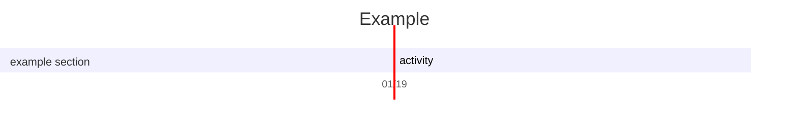

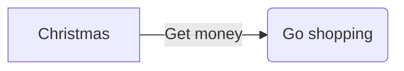

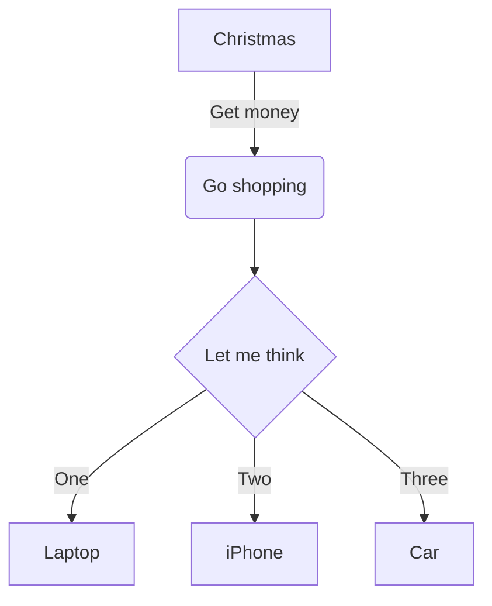

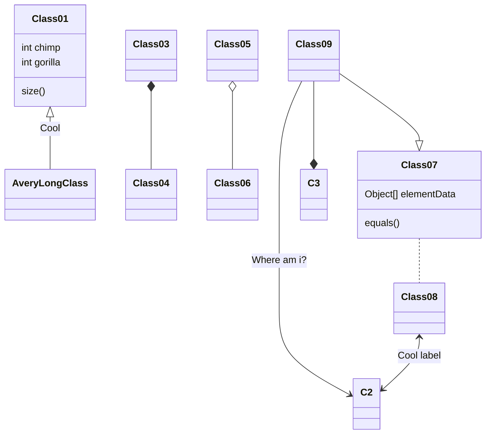

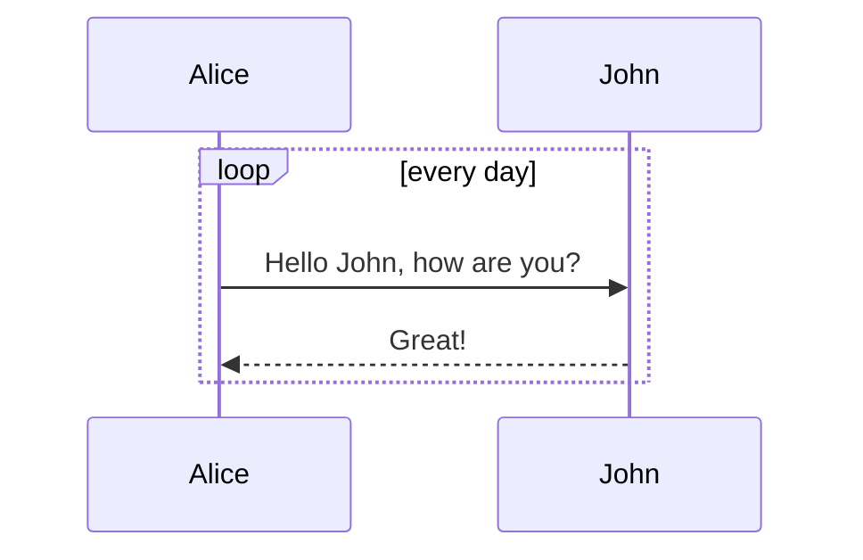

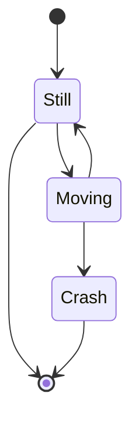

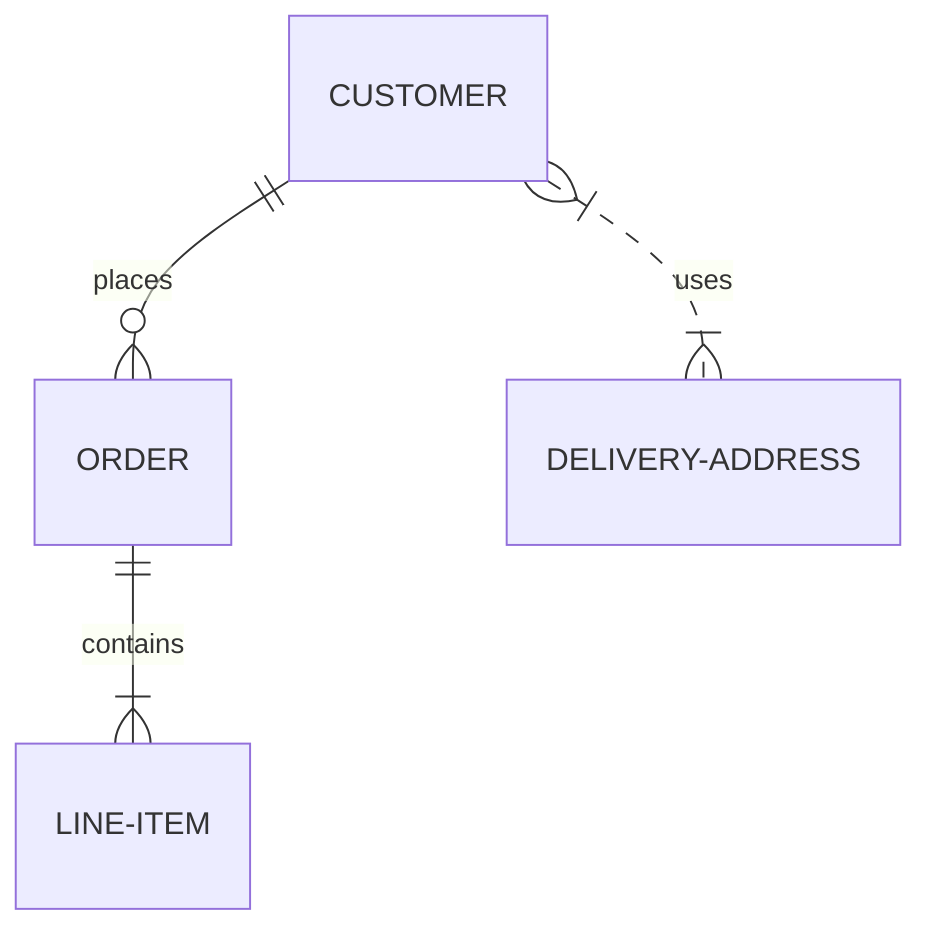

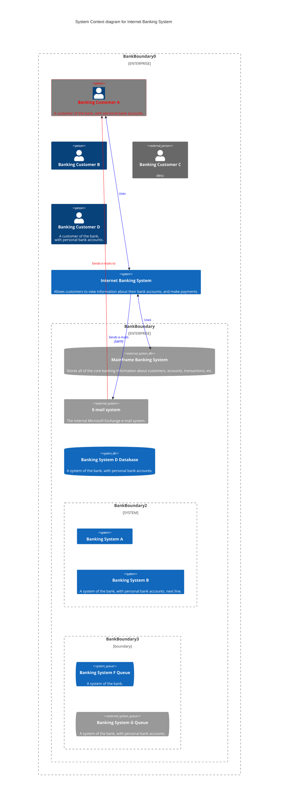

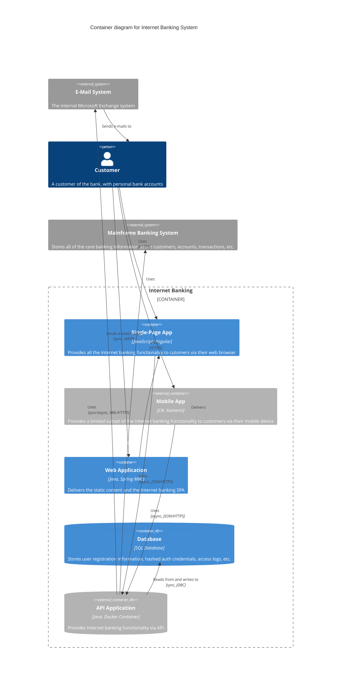

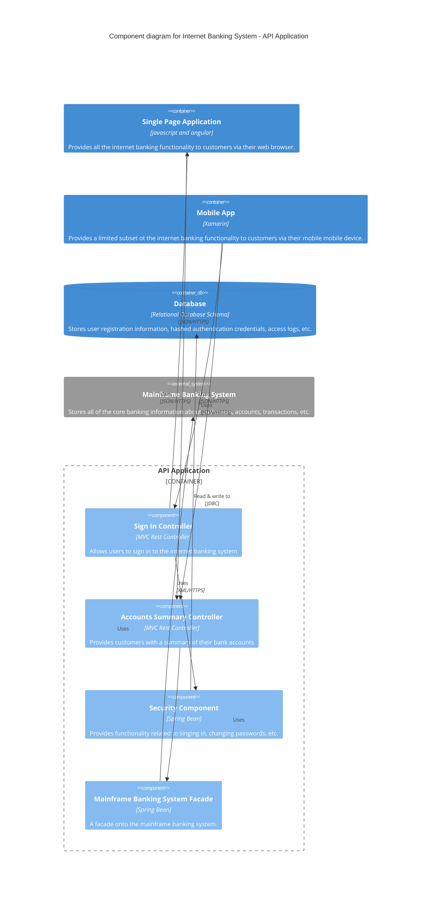

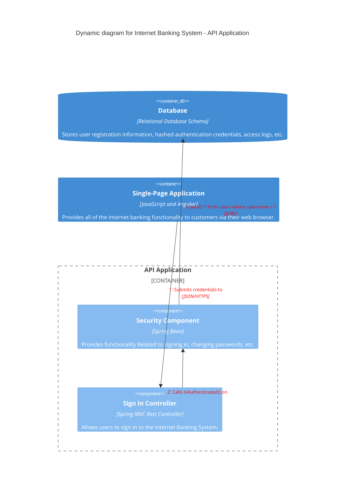

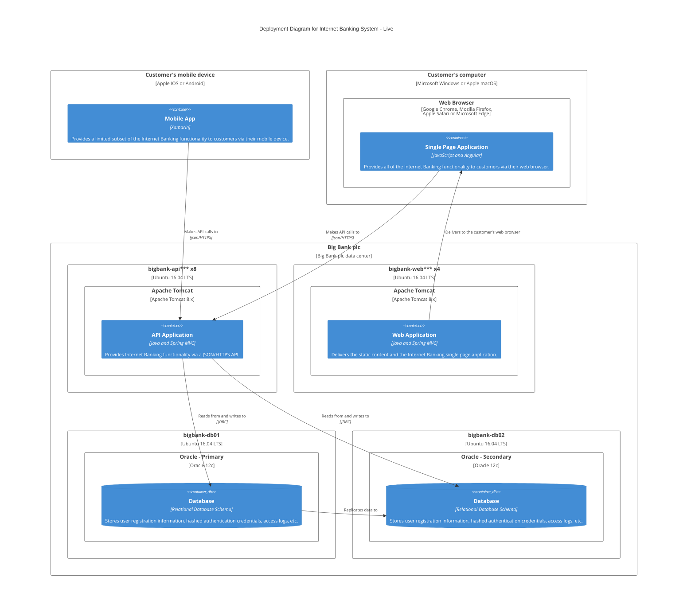
